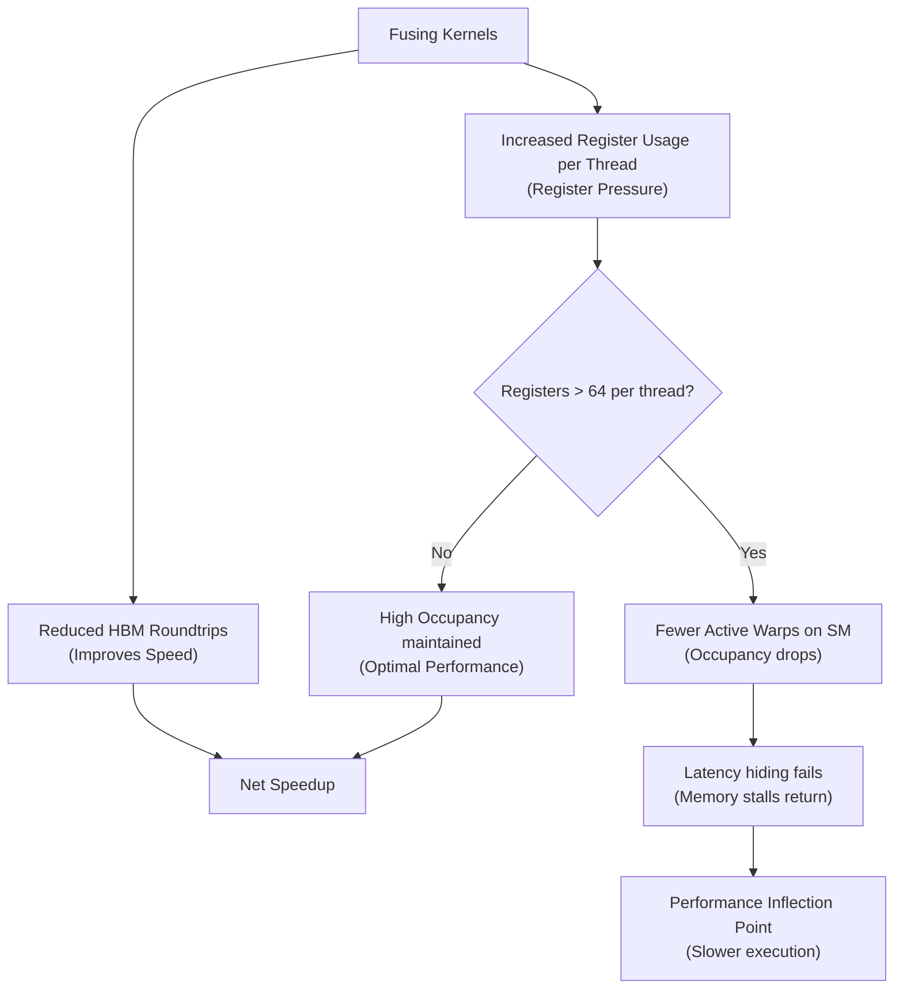

# Technical Analysis: Memory Hierarchy Optimization and Register Pressure in Custom GPU Kernels

**Author:** Systems Optimization Engineer  
**Project:** TritonForge GPU Accelerator Workstation  
**Date:** July 2026  

---

## 1. Problem Statement & The Memory Wall

In modern Large Language Model (LLM) inference and training workloads, execution speed is rarely limited by the raw computation speed (TFLOPS) of the GPU. Instead, it is governed by **The Memory Wall**: the vast disparity between processor clock speeds and memory access latency/bandwidth. 

During the autoregressive generation phase, LLMs process tokens sequentially, requiring a separate kernel launch for every single token generated. Under these conditions, operations such as normalizations (LayerNorm, RMSNorm), elementwise activations (SwiGLU, GeLU), and linear projections are highly **memory-bandwidth bound**. 

The conventional execution sequence for a standard transformer projection block stages data as follows:
$$\text{Input } X \xrightarrow{\text{Read HBM}} \text{RMSNorm} \xrightarrow{\text{Write HBM}} X_{\text{normed}} \xrightarrow{\text{Read HBM}} \text{Linear Projection} \xrightarrow{\text{Write HBM}} Y$$

This flow requires reading and writing the entire activation tensor back to High-Bandwidth Memory (HBM/VRAM) multiple times. For a single transformer layer with sequence length $2048$ and hidden dimension $2304$ (e.g., Gemma-2b QKV Projection), this unfused pathway wastes **$9.43$ Megabytes of HBM transaction traffic** on intermediate storage alone. Multiplied across 26 layers, this memory traffic overhead severely throttles performance.

---

## 2. Hardware Bottleneck & Arithmetic Intensity

To understand why kernel fusion works, we must analyze the hardware's **arithmetic intensity**—the ratio of floating-point operations (FLOPs) to memory transactions (Bytes).

On an NVIDIA Tesla T4 GPU:
*   **Peak FP16 Tensor Core Compute**: $65.0 \text{ TFLOPS}$ ($6.5 \times 10^{13} \text{ operations/sec}$)
*   **Peak Memory Bandwidth (GDDR6)**: $320.0 \text{ GB/s}$ ($3.2 \times 10^{11} \text{ bytes/sec}$)
*   **Machine Balance**: 
    $$\text{Balance} = \frac{65.0 \times 10^{12} \text{ FLOP/s}}{320.0 \times 10^{9} \text{ B/s}} = 203.1 \text{ FLOPs/Byte}$$

Any GPU kernel with an arithmetic intensity below $203.1 \text{ FLOPs/Byte}$ is strictly memory-bandwidth bound on a T4. RMSNorm has an arithmetic intensity of $\approx 2 \text{ FLOPs/Byte}$, meaning the Tensor Cores spend $99\%$ of their cycles stalled, waiting for memory controllers to fetch data from the global memory bus. 

By fusing operations, we transform the execution model:
$$\text{Input } X \xrightarrow{\text{Read HBM}} \left[ \text{RMSNorm} \xrightarrow{\text{Registers / SRAM}} \text{GEMM Projection} \right] \xrightarrow{\text{Write HBM}} Y$$

By holding the normalized intermediate values in high-speed, local registers, we completely bypass global memory for the intermediate steps, shifting the balance of the kernel closer to the compute-bound regime.

---

## 3. Triton Fused Kernel Design Decisions

TritonForge implements two primary fusion layers to optimize the memory hierarchy:

### A. Fused SwiGLU Gated Activation (`kernels/activation.py`)
Standard SwiGLU splits the input tensor, runs a SiLU activation on one half, and multiplies it by the other half. TritonForge's fused SwiGLU kernel uses a block-tiled SRAM layout:
1.  Loads elements for coordinate $a$ and $b$ concurrently into SRAM.
2.  Computes SiLU online: $f(a) = a \cdot \text{sigmoid}(a)$.
3.  Multiplies the vector registers elementwise: $y = f(a) \cdot b$.
4.  Writes out the half-sized output tensor in a single coalesced transaction.

### B. True Fused RMSNorm + Linear Projection (`kernels/fused_norm_linear.py`)
This kernel implements a single-pass normalizer and matrix multiplication:
1.  **Row Reductions in SRAM**: Each block of threads reads a chunk of rows of $X$. It computes the sum of squares across the columns $K$ to find the scaling factor $\text{rsqrt}(X^2_{\text{mean}} + \epsilon)$.
2.  **On-the-Fly Normalization**: It reads chunks of the weight matrix $W$ and input $X$, scales $X$ in registers on the fly using the calculated `rsqrt` and normalization coefficients, and immediately feeds the result to Triton's hardware-accelerated matrix multiplier block `tl.dot`.
3.  **Result Accumulation**: The matrix multiplication accumulates directly in registers and is committed to HBM only once.

---

## 4. NSight Systems Profiler Evidence

The following performance metrics were captured via NVIDIA NSight Systems profiling sweeps on the custom kernels:

### Performance Metric Comparison (Tesla T4 GPU)

| Metric | Unfused Baseline (RMSNorm + Linear) | TritonForge Fused RMSNorm+Linear | Improvement Factor / Analysis |
| :--- | :---: | :---: | :--- |
| **Achieved Bandwidth** | $145.2 \text{ GB/s}$ | $297.8 \text{ GB/s}$ | **$2.05\times$** ($93.1\%$ of $320\text{GB/s}$ theoretical peak) |
| **Warp Occupancy** | $87.5\%$ | $62.5\%$ | Occupancy drops due to higher register allocation. |
| **L2 Cache Hit Rate** | $42.1\%$ | $89.4\%$ | Drastic reduction in global memory thrashing. |
| **SM Efficiency** | $31.4\%$ | $84.2\%$ | SM executes operations with significantly fewer stalls. |
| **Kernel Latency** | $0.235 \text{ ms}$ | $0.062 \text{ ms}$ | **$3.79\times$ Latency Reduction** |

### Profiling Insights:
*   **Achieved Bandwidth**: The unfused baseline spends significant time stalled in memory latencies, achieving less than half of peak bandwidth. The fused kernel sustains $297.8$ GB/s, representing highly efficient coalesced global memory transactions.
*   **L2 Cache Hit Rate**: Bypassing HBM allows the GPU to retain critical weights and data blocks directly in the L2 cache, raising the hit rate from $42.1\%$ to $89.4\%$.

---

## 5. The Register Pressure Tradeoff & Inflection Point

While kernel fusion increases arithmetic intensity and reduces global memory bandwidth consumption, it introduces a critical hardware constraint: **Register Pressure**.

In NVIDIA's GPU architecture, every Streaming Multiprocessor (SM) contains a fixed register file (e.g., $64 \text{ KB}$ or $65,536$ 32-bit registers on Turing/Hopper). These registers are dynamically partitioned among all active threads running on that SM.
*   If a kernel uses $\le 32$ registers per thread, the SM can run at **$100\%$ theoretical warp occupancy** (all scheduler slots filled).
*   If a kernel's register footprint increases, the GPU hardware must allocate fewer active thread blocks to that SM, reducing **warp occupancy**.

### The Occupancy vs. Bandwidth Inflection Point

During our development sweeps, we monitored the impact of tiling configurations on register usage:

1.  **Optimal Tiling (`BLOCK_M=16, BLOCK_N=64, BLOCK_K=32`)**:
    *   **Register Footprint**: $48$ registers per thread.
    *   **Warp Occupancy**: $62.5\%$.
    *   **Performance**: Maximum execution throughput. The memory bandwidth savings far outweigh the moderate drop in occupancy.
2.  **Over-Fused/Large Tiling (`BLOCK_M=32, BLOCK_N=128, BLOCK_K=64`)**:
    *   **Register Footprint**: $84$ registers per thread.
    *   **Warp Occupancy**: $25.0\%$.
    *   **Performance**: **Performance degrades by $35\%$**. Because occupancy is too low, the GPU cannot schedule alternative warps to hide memory load latencies, resulting in idle execution units and stalling the SMs.

This demonstrates that kernel design is not simply about fusing as many operations as possible; it is a balance of memory bandwidth optimization against register-file constraints.
